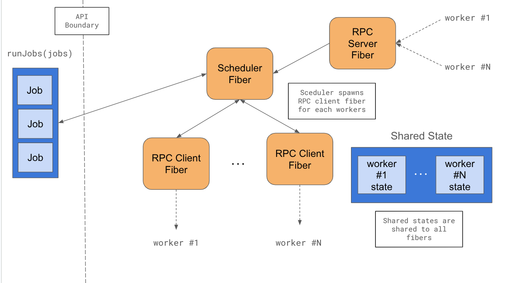
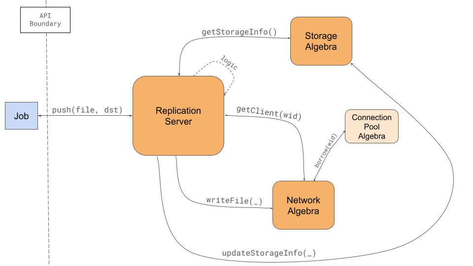
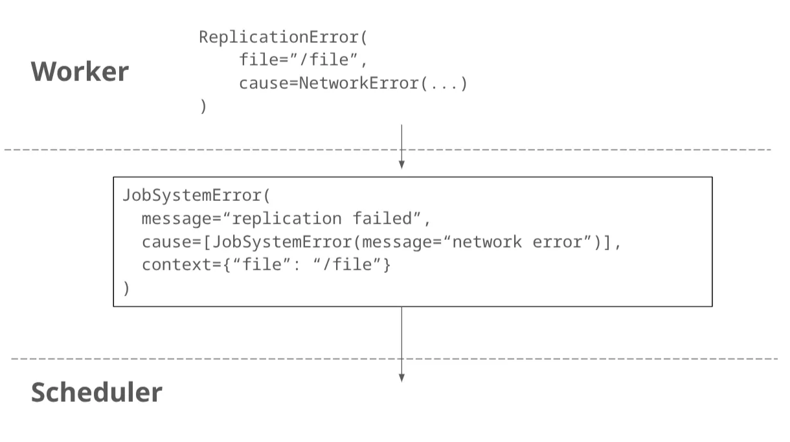

# Code Level Design Documentation

# Libraries

- Runtime
    - **cats-effect** for asynchronous runtime
- Networking
    - **fs2** for `Stream` abstraction
    - **scalapb** & **fs2-grpc** for protobuf and grpc on top of cats-effect
    - **grpc-netty** for grpc transport
    - **http4s** for web ui
- Logging
    - **log4cats** for logging
- Testing
    - **scalatest** as testing framework
    - **scalamock** for stubbing and mocking

# Project Structure

The project consists of following three subprojects.

- **jobs**: provide job scheduling system, which provides: job abstraction and implementations of key components: scheduler, worker, and file replication service.
- **worker**: a `worker` binary, which spawns multiple workers as processes, which define job handlers and run worker service provided by jobs package.
- **master**: a `master` binary, which spawns scheduler service provided by jobs packge, and implements distributed sorting algorithm on top of jobs abstraction.

## Directory Structure

All subprojects follow conventional [sbt scala project structure](https://www.scala-sbt.org/1.x/docs/Directories.html).

```
jobs/                   # job subproject
+-src/                  
	+-main/
	|	+-protobuf/         # .proto files, compiled by scalapb
	|	+-scala/
	|		+-redsort/
	|			+-worker/       # worker related codes
	|			+-scheduler/    # scheduler related codes
	|			+-fileserver/   # file server related codes
	+-test/
		+-scala/
		  +-redsort/        # unit tests for each components
		    +-worker/
		    +-scheduler/
		    +-fileserver/
		    
worker/                 # worker subproject, its structure is similar to jobs/
master/                 # master subproject, its structure is similar to jobs/
  
doc/                    # design documentations and progress reports

project/
	plugins.sbt           # sbt plugins
	Dependencies.scala    # project dependencies	
build.sbt
```

# Jobs

- package name: `redsort.jobs`

A library that provides implementation of job scheduling system. Exports `Scheduler` and `Worker`, which are ready-to use scheduler and worker implementations.

This library is built on top of cats-effects, which means that all functions defined by this package does not perform IO by itself.

## Scheduler

### API

```scala
def sortingProgram(scheduler: Scheduler): IO[...] = {
	// Create a sequence of `JobSpec`s to run
	val jobSpecs = Seq(
	  JobSpec(name="job a", input=..., output=...),
	  JobSpec(name="job b", input=..., output=...),
	)
	
	// Run jobs created above with `runJobs`. 
	// Will block current fiber until all jobs are completed.
	scheduler.runJobs(jobSpecs)
}

for {
  // initialiaze scheduler
	scheduler <- Scheduler(workers=List(...))
	
	// run sorting program and scheduler in parallel
	result <- (sortingProgram(scheduler), scheduler.run)
		.parMapN((_, _) => ExitCode.Success)
		.handleErrorWith { t =>
		  // somehow handle error
		}
} yield result
```

- `Scheduler.apply(workers: List[NetAddr])` initialize internal state and start up fibers. Unblocks when all workers are initialized.
- `Scheduler.runJobs(specs: List[JobSpec])` runs all jobs specified in `spec`. Returns `SchedulerStats` once all jobs are completed.

### Internal Architecture



- Scheduler is composed of multiple concurrent fibers, allowing system to interact with remote workers efficiently.
    - Scheduler fiber is a core fiber that 1. schedule and manage execution of jobs received from distributed program, and also 2. keeps track of states of workers.
    - RPC server fiber provides RPC service to workers.
    - There are one RPC client fiber per worker. They perform RPC request to corresponding worker and report result back to scheduler fiber.
- Fibers communicate usnig a queue. Each fibers are essentially a event loop that repeats dequeuing one message and do some work accoding to the message.
    - When user calls `runJobs`, jobs are enqueued to input queue of scheduler fiber.
    - Scheduler fiber also receives events from RPC server fiber (ex. Worker Registration) and RPC client fibers (ex. job failure).
    - Each RPC client fiber receives list of jobs from scheduler fiber. Client writes back successful job execution or errors back to scheduler fiber.
    - `runJobs` is notified by scheduler fiber when all jobs are completed.
- Fibers share internal states as a cats effect `Ref`.
    - Every fibers can read shared state.
    - *But only scheduler fiber can modify shared state.* This is to simplify control structure of system.

### Messages

Messages that can be sent to scheduler fiber is as follows:

```rust
enum SchedulerFiberEvents {
  // sent by `runJobs`:
  
  // program has requested execution of following jobs.
  // trigger scheduling.
  Jobs(specs: List[JobSpec])
  
  // sent by RPC server fiber:
  
  // WorkerHello RPC method has been called,
  // Update state of each worker, and if that worker is already UP,
  // trigger rescheduling.
  WorkerHello(hello: workerHello, from: Wid)
  // Worker did not call Heartbeat RPC method recently.
  // Update state of worker to DOWN and trigger rescheduling.
  HeartbeatTimeout(from: Wid)
  // Halt RPC method has been called.
  // Cancel RPC clients and server fibers and raise error.
  Halt(err: JobSystemError, from: Wid)

	// Helps accurate worker status tracking even in case where
	// scheduler receives status-related message in following order:
	//   1. WorkerHello
	//   2. WorkerNotResponding (or other fault detecting messages)
	// In this case, heartbeat will eventually change worker status to UP.
	Heartbeat(from: Wid)
  
  // sent by RPC client fiber:
  
  // Job has been completed.
  // Move running job into list of completed jobs.
  JobCompleted(result: JobResult, from: Wid)
  // Job errored on remote worker.
  JobFailed(result: JobResult, from: Wid)
  // Worker is not responding to RPC request even though its status is UP.
  WorkerNotResponding(from: Wid)
  
  // can be sent by anyone:
  
  // Unexpected internal error from one of fibers.
  FatalError(err: Throwable)
}
```

RPC client fibers receives following messages from scheduler fiber.

```rust
enum RPCclientFiberEvents {
  Job(spec: JobSpec),
  WorkerDown,
  WorkerUp,
}
```

`runJobs` receives `Either[Unit, Throwable]` from scheduler fiber once all jobs are completed or unrecoverable error has been occured.

### Scheduler Fiber Behavior

Scheduler fiber is started with input message queue `evtQueue` and shared state `sharedState`. It also maintains internal `schedulerState`, which is defined as follows.

```rust
struct SchedulerState {
  status: SchedulerStatus
}
  
// Initializing ---> Idle ---> Running ---> Idle
enum SchedulerStatus {
	Initializing				 // waiting for worker initialization, initial status
	Idle                 // not running any jobs
	Running              // running requested jobs
}
```

Scheduler handles each events as follows.

1. `WorkerHello(hello)`:
	1. Initialize worker’s status of `sharedState` according to `hello` and set worker status to UP.
	2. Check if this is first initialization. If not:
		1. Remove machine ID from all `replicas` of known intermediate files.
		2. If there is no `runningJob`, move one job from `pendingJobs` to `runningJob`.
		3. Enqueue `WorkerUp`, followed by `Job` (with its `spec` set to spec of `runningJob`) to input queue of RPC client of the worker.

2. `Heartbeat(from)`:
	1. restart timer that enqueues `HeartbeatTimeout` after 3 seconds.
	2. change status of worker to UP.

3. `HeartbeatTimeout(from)` or `WorkerNotResponding`:
	1. change status of worker to DOWN.
	2. Enqueue `WorkerDown` to RPC client of the worker.

4. `Halt` or `FatalError`:
	1. raise recieved error.

5. `JobCompleted(result, from)`:
	1. move running job to completed job.
	2. if all jobs are completed,
		1. update file entires of each machine according to `result`. Intermediate files used as input are deleted and outputs are added.
		2. notify main fiber that job execution was done.
	3. otherwise, submit another job to worker.

6. `JobFailed`
	1. raise error that indicates job execution has failed.

### RPC Client Behavior

1. `Job(spec)`:
	1. race following two tasks:
		1. call RPC `RunJob()` RPC method of worker.
		2. dequeue another `msg` from input queue and complete only if message is `WorkerDown`, ignoring all other messages.
	2. If `RunJob()` returned faster:
		1. if job was successful, enqueue `JobCompleted` to main fiber.
		2. otherwise enqueue `JobFailed`.
	3. If `WorkerDown` was received first, wait for `WorkerUp`, ignoring all other messages.
	4. If it errors, then it must be caused by RPC method.
		1. enqueue `WorkerNotResponding` to input queue of scheduler fiber.

2. `WorkerDown`: flush input queue until `WorkerUp`.

3. `WorkerUp`: ignore.

### RPC Server Behavior

- method RegisterWorker:
	1. Enqueue `WorkerHello` message to input queue of scheduler fiber.
	2. Once registration is complete, `SchedulerHello` with appropriate worker ID.

- method NotifyUp:
	1. Enqueue `Heartbeat` to scheduler fiber.

- method HaltOnError:
	1. Enqueue `Halt` message to scheduler fiber.

### `runJobs` Behavior

1. If job specs is empty, return.
2. Enqueue `Jobs` message to input queue of scheduler fiber.
3. Dequeue one message to input queue, then return it.

## File Replication Service

### API

```scala
// replication service initialized with the worker

// need:
//    -> wid: Wid for the worker (mid+wtid)
//    -> a locStorage: LocalStorageInfo for the mid

for {
	storageRef <- Ref.of[F, LocalStorageInfo](locStorage)
	storageAlg = new StorageAlgebraImpl[F](storageRef)
	
	connPool = new ConnectionPoolAlgebraImpl[F]()
	networkAlg = new NetworkAlgebraImpl[F](connPool)
	
	fileService = new FileReplicationService[F](
		logic = new ReplicationLogic(),
		storage = storageAlg,
		network = networkAlg,
		myWid = wid
	)
} yield fileService
```

- `FileReplicationService.apply(logic, storage, network, myWid)` : initialize the replication service
    - Storage: `Ref.of[F, A](initial)` creates a `Ref` with the initial value (e.g., the storage with only input files)
- `push(entry: FileEntry, dst: Int)` : transfer local file to remote machine, returning a replication diagnostic.
- `pull(entry: FileEntry, src: Int)` : receive remote file to local storage.

**TODO**: integration with jobs - is it orchestrated for each job (which has file replication) directly or should add a job integration interface?

### Components and Flow

```
fileserver/
+--Domain.scala                  # algebraic data types (errors, results)
+--ReplicationLogic.scala        # rules for replication
+--StorageAlgebra.scala          # interface for storage operations
+--NetworkAlgebra.scala          # interface for network operations
+--FileReplicationService.scala  # main service
+--impl/
	 +--StorageAlgebraImpl.scala   # Ref-based management (safer)
	 +--NetworkAlgebraImpl.scala   # gRPC with connection pooling
```

- Functional: logic is separate from effectful operations
- ADTs: better error handling
- Resource safety: using `Resource[_]` for connections and `Ref[_]`  for storage
- Streaming: fs2 streams for file transfers (more memory-efficient)

Example for `push(_)` :



*Fault-tolerance*

- Connection-pooling allows simultaneous transfers (useful when a replica is needed following a fault)
- Replica management (tracking locations)

*Other features*

- Connection pooling generally increases efficiency (fewer connection establishments and possible simultaneous interactions)
- Detailed diagnostics and errors
    - Errors specific to the file replication (for debug)
    - Integrate with overarching project error types (`toWorkerError(...)` -- or can be adapted to job errors)
- Separated components and type parameters, e.g., `F[_]` , for easier testing

### Class details

(to be completed — most implementation specifics are omitted below; due to lack of experience with cats-effect, its usage below may need to be adjusted)

- domain
    
    ```scala
    sealed abstract class ReplicationError extends Product with Serializable
    object ReplicationError {
    	final case class FileNotFound(entry: FileEntry) extends ReplicationError
    	final case class FileAlreadyExists(entry: FileEntry) extends ReplicationError
    	final case class NotEnoughSpace(need: Long, have: Long) extends ReplicationError
    	final case class WorkerUnavailable(wid: Wid) extends ReplicationError
    	final case class NetworkTimeout(op: String, wid: Wid) extends ReplicationError
    	final case class CouldNotConnect(wid: Wid, cause: String) extends ReplicationError
    	
    	// convert to WorkerError for integration
    	def toWorkerError(error: ReplicationError): WorkerError = error match {
    		case FileNotFound(entry) => WorkerError(WorkerErrorKind.InputReplicationError(entry), error.toString)
    		case FileAlreadyExists(entry) => WorkerError(WorkerErrorKind.OutputReplicationError(entry), error.toString)
    		case _ => WorkerError(WorkerErrorKind.BodyFuncError, error.toString)
    	}
    }
    
    // include checksum for verification of replication
    final case class ReplicationDiagnosticsWrapper(
    	diagnostics: ReplicationDiagnostics,
    	bytesTransferred: Long,
    	checksumVerified: Boolean
    )
    
    sealed abstract class ReplicationResult extends Product with Serializable
    object ReplicationResult {
    	final case class Success(
    		wrappedDiagnostics: ReplicationDiagnosticsWrapper,
    		updatedEntry: FileEntry
    	) extends ReplicationResult
    	final case class Failure(
    		error: ReplicationError,
    		wrappedDiagnostics: Option[ReplicationDiagnosticsWrapper]
    	) extends ReplicationResult
    }
    ```
    
- logic
    
    ```scala
    class ReplicationLogic {
    	// validate the replication (enough space, not overwriting, file exists, etc.)
    	def allowReplication(
    		localStorage: LocalStorageInfo,
    		entry: FileEntry,
    		targetWid: Wid, // dst / src
    		operation: String // push / pull
    	): Either[ReplicationError, Unit] = ???
    	
    	// for after the replication
    	def updateReplicasInFileEntry(entry: FileEntry, newReplicaMid: Int): FileEntry = ???
    	def toProjectDiagnostics(wrapped: ReplicationDiagnosticsWrapper): ReplicationDiagnostics = enhanced.diagnostics
    }
    ```
    
- storage
    
    interface:
    
    ```scala
    trait StorageAlgebra[F[_]] {
    	def getStorageInfo: F[LocalStorageInfo]
    	def updateStorageInfo(updater: LocalStorageInfo => LocalStorageInfo): F[Unit]
    	def getFileEntry(path: String): F[Option[FileEntry]]
    	def updateFileEntry(path: String, updater: FileEntry => FileEntry): F[Unit]
    	def createFileEntry(entry: FileEntry): F[Unit]
    	
    	// need enough space for intermediate results (sortings, partitions, etc.)
    	// --> can reserve space to prevent harmful replication (replicas taking up necessary space)
    	def reserveSpace(size: Int): F[Boolean]
    	def releaseSpace(size: Int): F[Unit]
    }
    ```
    
    implementation:
    
    ```scala
    class StorageAlgebraImpl[F[_]: Sync](
    	storageRef: Ref[F, LocalStorageInfo]
    ) extends StorageAlgebra[F] {
    	def getStorageInfo: F[LocalStorageInfo] = storageRef.get
    	def updateStorageInfo(updater: LocalStorageInfo => LocalStorageInfo): F[Unit] = storageRef.update(updater)
    
    	def createFileEntry(entry: FileEntry): F[Unit] = ???
    	def getFileEntry(path: String): F[Option[FileEntry]] = storageRef.get.map(_.entries.get(path))
    	def updateFileEntry(path: String, updater: FileEntry => FileEntry): F[Unit] = ???
      
    	def reserveSpace(size: Int): F[Boolean] = ???
      def releaseSpace(size: Int): F[Unit] = ???
    }
    ```
    
- network
    
    interfaces:
    
    ```scala
    // form protobuf services - should be generated by scalapb
    trait RemoteFileServiceClient {
    	def read(path: String): Stream[IO, Byte]
    	def write(path: String, data: Stream[IO, Byte]): IO[Unit]
    }
    
    trait NetworkAlgebra[F[_]] {
    	def getClient(wid: Wid): Resource[F, RemoteFileServiceClient]
    	def writeFile(client: RemoteFileServiceClient, path: String, data: Stream[F, Byte]): F[Unit]
    	def readFile(client: RemoteFileServiceClient, path: String): F[Stream[F, Byte]]
    	def healthCheck(wid: Wid): F[Boolean] // for connections
    }
    
    trait ConnectionPoolAlgebra[F[_]] {
    	def borrow(wid: Wid): Resource[F, RemoteFileServiceClient] // accessing a connection from the pools
    	def invalidate(wid: Wid): F[Unit] // either don't want to keep all connections at all times or discard unhealthy connections
    }
    ```
    
    implementations:
    
    ```scala
    class NetworkAlgebraImpl[F[_]: Async](
    	workers: List[Wid],
    	connectionPool: ConnectionPoolAlgebra[F]
    ) extends NetworkAlgebraImpl[F] {
    	def getClient(wid: Wid): Resource[F, RemoteFileServiceClient] = connectionPool.borrow(wid)
    	def writeFile(client: RemoteFileServiceClient, path: String, data: Stream[F, Byte]): F[Unit] = ???
    	def readFile(client: RemoteFileServiceClient, path: String): F[Stream[F, Byte]] = ???
      
    	def healthCheck(wid: Wid): F[Boolean] = ??? // can write an empty stream to check health?
    }
    
    class ConnectionPoolAlgebraImpl[F[_]: Async] extends ConnectionPoolAlgebra[F] {
    	// grpc client connections to other workers (wid -> pool of available connections to that worker, i.e., grpc client instances)
    	// queued -- enables concurrent transfers
    	private val pools: Ref[F, Map[Wid, Queue[RemoteFileServiceClient]] = ???
    	// (add a limit for number of connections?)
    	
    	def borrow(wid: Wid): Resource[F, RemoteFileServiceClient] = ???
    	// 2 aux for borrow:
    	def acquireClient(wid: Wid): F[RemoteFileServiceClient] = ??? // grab from pools or create new
    	def releaseClient(wid: Wid, client: RemoteFileServiceClient): F[Unit] = ???
    	
    	def invalidate(wid: Wid): F[Unit] = ???
    	
    	private def createNewClient(wid: Wid): RemoteFileServiceClient = ??? // grpc client creation
    }
    ```
    
- replication service
    
    ```scala
    class FileReplicationService[F[_]: Async](
    	logic: ReplicationLogic,
    	storage: StorageAlgebra[F],
    	network: NetworkAlgebra[F],
    	myWid: Wid
    ) {
    	// push to specified machine id
    	def push(entry: FileEntry, dst: Int): F[ReplicationDiagnostics] = {
    		// 1. is replication possible? -> storage+logic
    		// 2. try transfer -> execute via network
    		//          -> network.getClient(dst), then read local and write to remote
    		// 3. result (success/failure)
    		// 4. extract diagnostics (unwrap)
    	}
    	private def executePush(
    		entry: FileEntry,
    		src: Wid,
    		dst: Wid,
    		start: Float
    	): F[ReplicationResult] = ??? // concrete transfer operations (via network.getClient(dst)...)
    	
    	// pull from specified machine id
    	def pull(entry: FileEntry, src: Int): F[ReplicationDiagnostics] = {
    		// 1. possible? can afford (enough free/unreserved space)? -> storage+logic
    		// 2. try transfer -> execute via network
    		//          -> network.getClient(src), then read remote and write to local
    		// 3. result (success/failure)
    		// 4. extract diagnostics (unwrap)
    	}
    	private def executePush(
    		entry: FileEntry,
    		src: Wid,
    		dst: Wid,
    		start: Float
    	): F[ReplicationResult] = ??? // concrete transfer operations (via network.getClient(src)...)
    ```
    

# Sending Exception



Errors raised in one component should be able to be serialized and transmitted to other workers. Type `JobSystemError` serves that purpose. It is defined as a protobuf message and is similar to following definition:

```rust
struct JobSystemError {
  message: String
  cause: Option[JobSystemError]
  context: Map<String, String>
}
```

`cause` field creates a chain of exceptions which is helpful in debugging. Also there is a `context` field which can contain arbitrary key-value entries that might be helpful.

Components define their own error types, and they should be convertible to `JobSystemError`. In order to do so, they should implement trait `SerializableError` which has only one method `serialize`, which converts error into `JobSystemError`.

Note that this exception type is NOT designed to be understood by code. `JobSystemError` must be understood as a opaque error type that represents remote error, aiding debugging. So if one need to distinguish types of remote errors, it must be wrapped in an appropriate structure that allows pattern matching.

# Seperating I/O from code

## Introduction

We seperate code that perform actual I/O into multiple typeclasses. Actual implementations of these typeclasses are passed to its user as a implicit parameter. This allows us to swap actual implementation of those typeclasses while testing, allowing us to test functions involving I/O without actuall performing it.

For example, when seperating file I/O from code, first we define typeclass `Files` which looks like this:

```scala
trait Files[C] {
  def read(path: String): IO[String]
  ...
}
```

Then, we define enum `AppContext` that has two members: `Production` and `Testing`.

```scala
sealed abstract class AppContext
object AppContext {
	case object Production extends AppContext
	case object Testing extends AppContext
}
```

Next, we provide typeclass instances `Files[Production]` and `Files[Testing]`. This allows us to write code like as follows:

```scala
def readMyFile[E: Files](): IO[String] =
  Files[E].read("myFile.txt")
  
// in actual implementation:
import AppContext.Production
readMyFile()

// while testing:
readMyFile[AppContext.Testing]()
```

## Typeclasses

As discussed earlier, we define `AppContext` with two subtypes `Production` and `Testing`. We define following typeclasses:

- `Files[E]`: file system access
- `WorkerClient[E]`, `WorkerServer[E]`: RPC client/server for worker
- `SchedulerClient[E]`, `SchedulerServer[E]`: RPC client/server for scheduler
- `ReplicatorLocalClient[E]`, `ReplicatorLocalServer[E]`, `ReplicatorRemoteClient[E]`, `ReplicatorRemoteServer[E]`: RPC client/server for file replication service

… and also following typeclasses that combines some of above typeclasses for cleaner function signature:

- `ReplicatorCtx[E]`: `Files` + `ReplicatorRemoteServer` + `ReplicatorLocalServer` + `ReplicatorRemoteClient`
- `WorkerCtx[E]`: `Files` + `WorkerServer` + `SchedulerClient` + `ReplicatorLocalClient`
- `SchedulerCtx[E]`: `WorkerClient` + `SchedulerServer`

# Distributed Sorting

## Job Handlers

See `master/src/main/scala/redsort/master/DistributedSortingSpec.scala` for more details on what job specs are submitted to workers in each stages.

### Sampling

- Name: `sample`
- Input: a single input file
- Arguments: None
- Output: None
- Returns: up to 1MB samples extracted from head of input file
- Parallelism: only one worker per machine runs this job.

Example job spec: this job extracts sample from file `@{input}/chunk.0`.

```scala
new JobSpec(
		name = "sample",
		args = Seq(),
		inputs = Seq(
			new FileEntry(path = "@{input}/chunk.0", size = 128_000_000, replicas = Seq(0))
		),
		outputs = None
)
```

### Sorting

- Name: `sort`
- Input: a single file, from inputs directory
- Arguments: None
- Output: a single file, saved to working directory
- Returns: Nothing
- Parallelism: multiple workers can be run in parallel on same machine.

Example jop spec: this job sorts input file `@{input}/chunk.0` and save sorted output to `@{working}/sorted.0`.

```scala
new JobSpec(
	name = "sort",
	args = Seq(),
	inputs = Seq(
		new FileEntry(path = "@{input}/chunk.0", size = 128_000_000, replicas = Seq(0))
	),
	outputs = Seq(
		new FileEntry(path = "@{working}/sorted.0", size = -1, replicas = Seq(0))
	)
)
```

### Partitioning

- Name: `partition`
- Input: a single sorted file produced by `sorting` job.
- Arguments: sequence of partition "end"s. For example, if cluster consists of two machines and key ranges assigned to each of them are `[0, 0x100)` and `[0x100, MAX_KEY + 1)`, then arguments are set to `Seq(0x100, MAX_KEY + 1)`.
- Returns: None
- Parallelism: multiple workers can be run in parallel on same machine.

Example job spec: Suppose a clsuter with two worker machines. This job partitions sorted records `@{working}/sorted.0` into two files `@{working}/partition.0.0` and `@{working}/partition.0.1`, which will be consumed (at the merging step) by machine 0 and machinie 1, respectively.  

```scala
new JobSpec(
	name = "partition",
	args = Seq(
		new BytesArg(ByteString.fromhex("0100")),
		new BytesArg(ByteString.fromhex("0100000000000000000000"))
	),
	inputs = Seq(
		new FileEntry(path = "@{working}/sorted.0", size = 128_000_000, replicas = Seq(0))
	),
	outputs = Seq(
		new FileEntry(path = "@{working}/partition.0.0", size = -1, replicas = Seq(0)),
		new FileEntry(path = "@{working}/partition.0.1", size = -1, replicas = Seq(0))
	)
)
```

### Merging

- Name: `merge`
- Input: partition files of pattern `@{working}/partition.<i>.<mid>` where `i` is any integer and `mid` is machine ID of a worker runnign the job.
- Arguments: None
- OUtput: output partition files, whose size is 128MB or lower.
- Returns: None
- Parallelism: only one worker per machine runs this job.

Example job spec: (Suppose same cluster configuration as in partitioning step) This job merges partition file `@{working}/partition.0.0` (on machine 0) and `@{working}/partition.1.0` (on machine 1) into output files `@{output}/partition.{0..2}`. `@output/partition.{0,1}` will have size of 128MB while `@output/partition.2` is smaller.

```scala
new JobSpec(
	name = "merge",
	args = Seq(),
	inputs = Seq(
		new FileEntry(path = "@{working}/partition.0.0", size = 64_000_000, replicas = Seq(0)),
		new FileEntry(path = "@{working}/partition.1.0", size = 64_000_000, replicas = Seq(1))
	),
	outputs = Seq(
		new FileEntry(path = "@{output}/partition.0", size = 128_000_000, replicas = Seq(0)),
		new FileEntry(path = "@{output}/partition.1", size = 128_000_000, replicas = Seq(0))
		new FileEntry(path = "@{output}/partition.2", size = 14_152_531, replicas = Seq(0))
	)
)
```