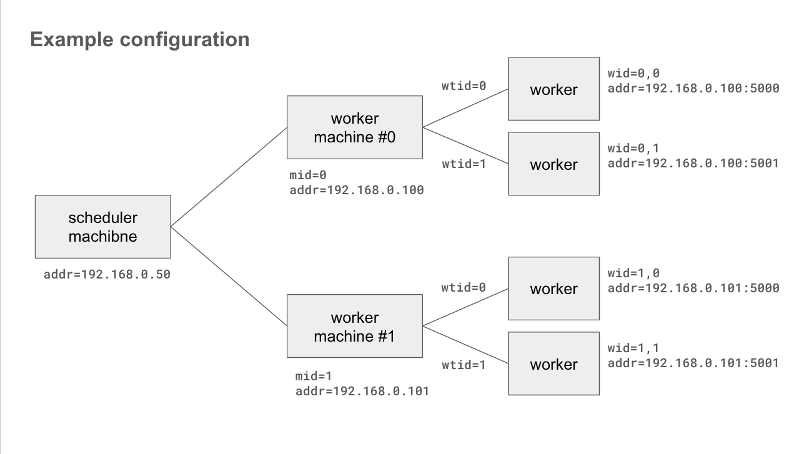
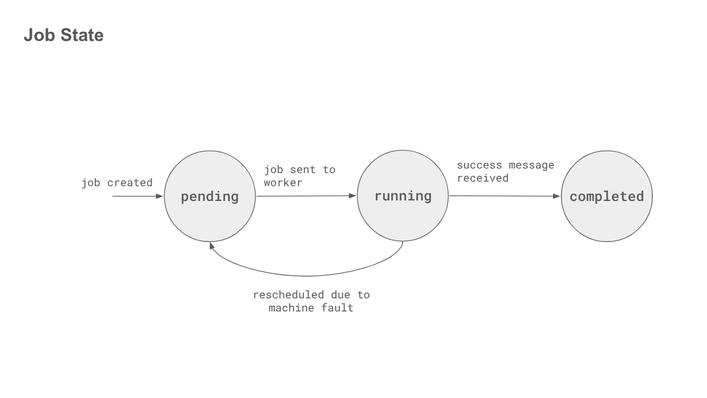
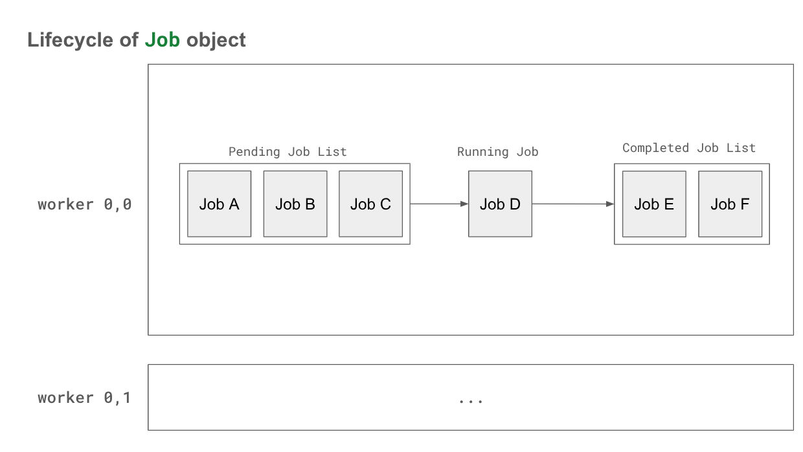

# Design Documentation

# About This Documntation

## Status

This is a design documentation describing high level architecture of the project.

This document is not complete. Following points must be addressed before finalization.

- Job specs created by each stages of distributed sorting, shown in “Distributed Sorting” section, need to be changed to conform to updated `JobSpec`.
- “Fault Tolerance” section is missing.

## Purpose and Scope

The goal of this documentation is to specify a high level system architecture of fault-tolerant distributed sorting program.

This document covers following subjects:

- Key abstractions to enable distributed and fault-tolerance system.
- Important data structures and algorithms.
- Components and their responsibilities.

This document does NOT cover following subjects.

- Classes, traits, and other kinds of code-level architecture.
- Which libraries are used.
- Network connectivity between machines.

## Notations

Structures are formalized using a hypothethical programming language similar to Rust and Scala. All data structures are algebraic data types: `struct` represents product type and `enum` represents sum type.

# Objectives and Assumptions

The goal is build a correct and robust system that sorts data distributed across machines.

## Input and Output

We are given a cluster of machines. There are N worker machines and a one master machine.  physical processors are available to each machines. All machines are interconnected using a commodity network.

Input files are stored in each storage of worker machines. We assume there are total *N* chunks and are stored as `/input/chunk.{n}` where *n* is a increasing sequence of integers from 0 to *N-1*. Each chunk contains sequence of records. Each record is a 100 bytes long. Its first 10 bytes is a key and trailing 90 bytes is a value. Key distribution can be either even or skewed. There can be an nonunique, overlapping key.

Output files should be stored as `/output` directory of each machines. Each machine creates files `/output/partition.{n}` where *n* can be any integer. Data must be sorted in ascending order when all output files are merged in ascending order of file names.

## Assumptions on Faults

We define **machien fault** as an unexpected restart of one of workers while sorting is in progress. Upon restart, worker program is restarted but file system gets reverted back to original state, which means all intermediate files are gone. Duration of a machine fault is unknown, thus the system should handle the fault regardless of how long the worker machine is down.

We assume other types of fault does not happen. This includes disk failure or restart of a master machine.

## Assumptions on Network

We assume there is a reliable and ordered network channel between any pairs of machines available unless one of machine is down.

## Assumptions on Storage

Let combined size of all input files be *M* and combined size of local storage size of all worker machines be *N*. We assume *N* to be at least twice as large as *M.* In other words, it must be possible to replicate all input files at least once. No assumptions are made regarding available storage of each worker machines.

# Job Scheduling System

## System Configuration

A cluster consists of multiple slave machines and a single master machine. Slave machines run multiple worker programs and are thus called worker machines. A master machine runs scheduler programs and is called the scheduler machine.

A worker is a program that executes a job upon request from a scheduler. Each worker receives a job request from a scheduler and returns the result using a network. Each worker is assigned a unique IP:PORT pair.

Each worker is assigned a **worker ID** or **wid**. Worker ID is a tuple (mid, wtid) where **mid** (machine ID) identifies a physical machine and **wtid** (worker thread ID) identifies each thread in a machine.

A scheduler is a program that assigns jobs to workers. Its primary role is to distribute jobs so as to minimize communication overhead among workers.

The following figure shows an example system configuration with two worker machines each running two workers as threads.



Scheduler and workers interact using RPC. Methods exposed by scheduler and worker are described in the following sections.

## Initialization

Worker calls `RegisterWorker` method of scheduler upon start or restart (possibly due to machine fault). An argument to this method, `WorkerHello`, contains wtid of worker. If wtid is 0, worker also sends lit of available input files and remaining storage capacity.

When scheduler is initially started, it creates two data structures: **worker status table** and **global file directory**. 

- Worker status table is a table of `WorkerInfo`s which contains status of a worker plus some informations like worker ID or network address. Each `WorkerInfo` is initialized with `status` field set to DOWN and `initialized` set to false.
- Global file directory indexes all files in worker machines.

```rust
let workerStatusTable: 
	Map[Wid, WorkerInfo]

struct WorkerInfo {               
  wid: Wid                            
  addr: NetAddr                       
  status: WorkerStatus                
  initialized: Bool         // Flag indicating whether WorkerHello was received
}

enum WorkerStatus {                  // Indicates whether worker is online.
  UP
  DOWN
}

let globalFileDirectory:
	Map[Int, LocalStorageInfo]
```

Scheduler updates status of worker to UP, set `initialized` to true, and update global file directory. It responds back with `SchedulerHello`. 

## Job

Job is a atomic unit of a distributed program. 

A single job consists of input file specifications, job name, and output file specifications.

```rust
// Example: a job specification sent to some worker that sorts a file "/input/chunk.0" and writes result to "/working/sort/0_0/chunk.0"
JobSpec {
	name: "sort",
	args: [],
	inputs: [{
		name: "/input/chunk.0",
		size: 12345678,
		replicas: Some([0])   // input file is only available on machine 0.
	}],
	outputs: [{
		name: "/working/sort/0_0/chunk.0",
		size: -1,             // Output file size is unknown.
		replicas: Some([0])   // Output file will be placed to same machine.
                          // Note that this field is not restrictive - file can be replicated to other machines as well.
	}]
}
```

`FileEntry` of input and output files are subject to following restrictions.

- `path` field must be a globally unique, since files can be replicated to multiple machines.
- `replicas` field:
    - For input file specs this must be `Some`. If input file is not available in local storage of a machine running a job, it will be replicated from one of machines specified by this field.
    - For output file specs this can be either `Some` or `None`. If `None`, scheduler might decide where to replicate each files.
- `size` field:
    - For input file specs this must be actual size of input file.
    - For output file specs this field is ignored. It is allowed to set this field to -1 in that case.

## Worker Behavior

### Worker RPC Methods

Worker exposes following RPC methods to scheduler.

<ins>RunJob(spec: JobSpec) → JobResult</ins>

Run a job specified by `spec`. 

1. Replicate input files that are not present in the local machine.
2. Execute job body function.
3. Replicate all output files to machine specified in `replicas` field of output file specs.

If input file is not present, worker will replicate the file from one of machines specified in `replicas` field. Replication failure is reported back only if replication from all `replicas` fail - failure on only part of `replicas` are not reported back.

Once input files are prepared, job body function gets executed. `success` field of `JobResult` indicates whether job execution was successful. If body function raises error, failing `JobResult` is returned with `error` field set to source of error. Body function must make sure to revert changes made to disk. 

After body function terminates, output files are replicated to machines specified in `replicas` field. Worker might choose to replicate outputs to machines NOT specified here for fault tolerance.

This method returns error when worker is running a job. In this case `error` field is set to `Some(WorkerBusy))`. 

<ins>Halt(reason: String) → None</ins>

Forcefully halts the worker.

### Heartbeat

Worker also periodically invoke `NotifyUp` RPC method of scheduler every 3 seconds.

## Scheduler Behavior

### Job Lifecycle

Scheduler receives list of `JobSpec` from distributed program. These jobs must not have dependencies and thus parallelizable. It creates a `Job` object which is a `JobSpec` plus informations required to track job status.

```rust
struct Job {
	state: JobState
	spec: JobSpec
}

enum JobState {
	Pending
	Running
	Completed
}
```

Meaning of each `state` is as follows:

- `Pending`: Job is waiting to be sent to worker. This is initial state. A job in this state is either fresh or re-schedule due to machine fault.
- `Running`: Job is sent to worker and being run by worker.
- `Completed`: Job completed without error.

Below is a state diagram of `Job`.



Scheduler internally maintains list of `Job`s per worker. For each worker, `Job` is stored in distinct locations by its state. `pending` jobs are stored in pending job list, `completed` jobs in completed job list. `running` job is stored seperately. Scheduler perform **scheduling** procedure to fill pending job list of each workers. Job is popped from pending job list and submitted to a worker with status ON. If running job succeeds, it is moved to completed job list, and another job is popped from pending job list. 



Job failure can be divided into two classes: job error and worker error. 

- Job error happens when worker is behaving normally but job execution was failed. In this case error is raised to halt scheduler.
- Worker error happens when worker is malfunctioning, for example RPC request failing to be delivered to worker. This indicates machine fault and will be handled accordingly.

Scheduler returns once all jobs are completed.

### Scheduling

Scheduler choose on which worker to run each job. 

Currently scheduling is done in following fashion.

1. If JobSpec has one or more output files, then schedule the job to first element of `replica` field of first output file spec.
2. If job does not have output file, then schedule the job to first element of `replica` field of input file.
3. If job also does not have input file, schedule it to worker with least jobs.

### Synchronization

After all jobs are completed, scheduler additionally queues “synchronization” jobs to one of worker of each machine. Argument of job contains file entries of `/working` directory. Worker will sync local directory with these entries by removing no longer needed files and replicating missing files with `pull` method of file replication service.

This step is implemented as a job rather than RPC method in order to be fault tolerant.

### Scheduler RPC Methods

Scheduler exposes following RPC methods to workers.

<ins>RegisterWorker(hello: WorkerHello) → SchedulerHello</ins>

Register new worker. Called by when new worker is spawned or is restarted by machine fault.

Worker reports its wtid and optionally local storage information (input files and remaining storage). Local storage infomration is only reported by worker with wtid 0.

Scheduler updates global file directory and changes worker status to UP. It responds with `SchedulerHello` which contains wid assigned to the worker.

<ins>NotifyUp() → None</ins>

Heartbeat mechanism. Worker should call this method for every 3 seconds. Worker that did not called this method more than 7 seconds is considered DOWN.

<ins>HaltOnError(err: JobSystemError) → None</ins>

Forcefully halts entire job system. Use this method to report unexpected errors raised in worker.

## File Replication Service

Each machine runs a file replication service, which is a program that can **push** a file to another machine or **pull** a file from another machine. The service runs independently from workers. It exposes two RPC service, one for local workers and one for remote file replication services.

Following RPC methods are available to local workers.

<ins>Push(path: String, dst: Int) → ReplicationDiagnostics</ins>

Push local file with given `path` to machine with ID `dst`, make sure the file is written on the disk of remote machine, then return.

<ins>Pull(path: String, src: Int) → ReplicationDiagnostics</ins>

Pull remote file avilable at machine with ID `src` to current machne, make sure the file is written on the disk, then return.

---

Following RPC methods are available for remote file replication services.

<ins>Read(path: String) → Stream[Bytes]
</ins>

Return contents of local file as a stream of bytes.

<ins>Write(path: String, data: Stream[Bytes]) → None</ins>

Write data stream to specified path. Path must NOT be present in local storage, i.e. no overwrite is allowed.

# Distributed Sorting

We can write a distributed sorting program by using the job scheduling system described above.

The procedure is divided into 4 parts: **sampling**, **sorting**, **partitioning**, and **merging**. At each step, the program splits the step into multiple parallelizable jobs, pass it to scheduler, and wait for scheduler to finish. 

We assume the cluster consists of N machines and C threads in each machine. There are in total N x C workers. In actual environment, N = 20, and C = 4.

## Sampling

For each machine id *mid*, find a *path* of randomly chosen chunk file that is available on that machine. Then, create and schedule the following jobs.

- Input:
    - name: `<path>`
- Arguments: None.
- Output: None.
- Return value: List of ~1MB keys samples from input file.

Scheduler will schedule each job to one of worker with machine ID *mid*.

Upon completion, master aggregates and sorts samples to find N x C + 1 pivot points.

Based on the pivot points, each worker (`<mid>_<wtid>`) gets assigned a range and an index for this range (to follow the output guidelines {partition.<n>, partition.<n+1>, … for some n} — project presentation, slide 23).

## Sorting

Let *path* be a local path of a file `/input/chunk.<i>` where *i* ranges from 0 to *S*. Let *mid* be a machine ID storing the file.
Let *n* be a integer from 0 to *S*. Create and schedule the following jobs for each input file:

- Input:
    - name: `<path>`
- Output:
    - name: `/working/sorted.<n>`
    - replicas: `[<mid>]`
- Arguments: None.
- Return value: None.

This will create a sorted chunk file on each machine.

## Partitioning

For every file `/working/sorted.<i>`, create and schedule the following jobs for each sorted chunk file (files `/working/sorted.<i>` with *i* in {*0*, …, *S-1*}).

- Input:
    - name: `/working/sorted.<i>`
- Output:
    - name: files of the form `/working/partition.<n>.<m>` where *n* is in range `[0, number of machines)` and *m* can be any integer starting from 0.
    - replicas: `[<mid>]`
- Arguments: mapping of all pivot points (from **Sampling**).
- Return value: None.

This will prepare all the needed files for merging.

## Merging

For every machine with *mid*, create and schedule the following jobs.

- Input:
    - name: all files matching the pattern `/working/partition.<i>.<mid>` where *i* is integer in range `[0, number of machines)`.
- Output:
    - name: multiple files named `/output/partition.<n>` where `<n>` can be any integer starting from 0 (but it must be globally unique).
    - replicas: `[<mid>]`
- Arguments: None.
- Return value: None.

# Fault Tolerance

Fault tolerance is achieved by following mechanisms:

1. All job outputs are stored on at least two machines. This ensures no files are lost due to machine fault.
2. Scheduler tracks each workers' status (as UP or DOWN) using various mechanisms and stops dispatching job to worker with status DOWN.
3. Worker can pull missing input files from other machines. This make it possible to run jobs on machine that faulted.

These three simple rules can ensure all jobs can be run even in presence of machine fault.

Detailed description on fault tolerance mechanism can be found in code level design documentation.

# Appendix

## Glossary

**Scheduler**: Program that schedules job.

**Scheduler Machine**: Machine on which scheduler runs. Usually the master machine of a cluster.

**Worker**: Program that executes job assigned by scheduler.  

**Worker Machine**: Machine on which workers run. Usually slave machines of a cluster.

**Worker ID** or **wid**: Integer ID of a worker program. 

**Worker Thread ID** or **wtid**: Integer ID of a worker thread in a machine.

**Machine ID** or **mid**: Integer ID of a worker machine.

**Job**: Atomic unit of a distributed program.

**Job Body function**: Function associated with a specific job name.

## Common Structures

This section documents common data types and structures shared by scheduler and worker RPC services.

```rust
// --------------- Common ---------------
struct Wid {                        // Worker ID.
  mid: Int
  wtid: Int
}

struct NetAddr {                    // Network address of a worker.
  ip: String
  port: Int
}

// --------------- Storage ---------------
struct LocalStorageInfo {
  mid: Option[Int]
	entries: Map[String, FileEntry]   // List of file entries, indexed by path.
	remainingStorage: Int             // Remaining storage of machine as bytes.
}

struct FileEntry {
  path: String                   // Local path to a file.
  size: Int                      // Size of a file.
  replicas: Option[List[Int]]    // List of mids this file is replicated to.
}

// --------------- Job ---------------
struct JobSpec {
	name: String                  // Job name.
	                              // Worker will invoke function associated with 
	                              // a job name.
	args: List[Any]               // List of arguments passed to job body function.
	inputs: List[FileEntry]       // List of input files.
	outputs: List[FileEntry]      // List of output files.
	outputSize: Int               // Total size of output files.
}

struct JobResult<T> {
  success: Bool                 // Indicate whether job execution was successful.
  retval: Option[T]             // Return value of job, only set 
                                // if job succeeded.
  error: Option[WorkerError]    // Error happened during execution of job.
  outputs: List[FileEntry]      // List of output files with actual sizes.
  diagnostics: {
    inputReplications: List[ReplicationDiagnostics]
    outputReplications: List[ReplicationDiagnostics]
    calculationTime: Int
  }
}

struct WorkerError {
	kind: WorkerErrorKind
	message: String
}

enum WorkerErrorKind {           
  InputReplicationError(entry: FileEntry)
  BodyFuncError
  OutputReplicationError(entry: FileEntry)
  WorkerBusy
}

struct ReplicationDiagnostics {
  entry: FileEntry
  src: Int
  dst: Int
  start: Float
  end: Float
}

// --------------- Initialization ---------------
struct WorkerHello {
  wtid: Int                               // Worker thread ID.
  storageInfo: Option[LocalStorageInfo]   
}

struct SchedulerHello {
  wid: Wid
}
```

## Additional Resources

All figures are drawn using google slides, available [here](https://docs.google.com/presentation/d/1gKtUXpD9e8Lo758RF1eF3A3uYg0BUHB01yP6cAaQJBw/edit).